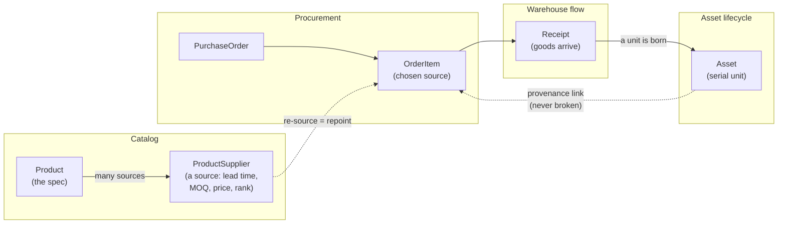
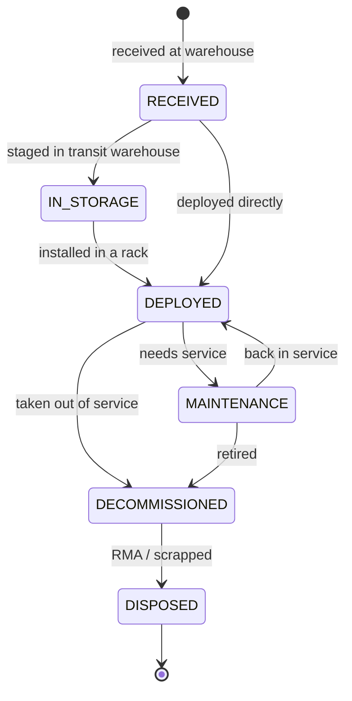

# SCM Master

A supply-chain management system for **hardware procurement and asset lifecycle tracking** — built for the case where a small, fast-turning *transit warehouse* feeds equipment into datacenter racks.

It joins together three things that off-the-shelf tools usually keep apart:

1. **Procurement** — what you buy and from whom.
2. **Warehouse flow** — receiving goods into a transit warehouse.
3. **Asset lifecycle** — following each physical unit from arrival all the way to decommission.

## What makes it different

Most warehouse apps stop at "stock in, stock out." Most CMDBs (configuration-management databases) only start once a unit is already racked. Neither follows a single unit across that boundary.

This system models the **continuous identity of an asset** as its spine. When a serialised unit is received, an `Asset` is born. The *same* row then moves through the warehouse and into a rack — its location and status change, but its identity, and its link back to the purchase-order line it came from, never breaks. That unbroken thread is what makes end-to-end spend and provenance tracing possible.

The second deliberate design choice is **multi-sourcing**. A `Product` (the spec) is kept separate from a `ProductSupplier` (one row per source of that product). "Replacing a supplier" — critical under spiky demand and long chip lead times — is then just choosing a different source, without losing the product's identity or its purchase history.

## How it flows

The process the system models, end to end — from picking a source to a unit's final disposal:



### Asset lifecycle (the spine)

A single serial-tracked unit, followed for its whole life. Its location and status change, but its identity — and its link back to the order line it came from — never breaks:



## Domain model

The data model is organised into three modules under [`backend/app/models/`](backend/app/models/):

### Catalog — *the what and the who-we-buy-from* ([`catalog.py`](backend/app/models/catalog.py))

| Entity | Role |
| --- | --- |
| `Organization` | A company we deal with — supplier and/or manufacturer (flagged by role, so one org can be both). |
| `Product` | The supplier-independent spec (a server model, a CPU SKU, a DIMM). Hardware doesn't expire, so there's deliberately no expiry field. |
| `ProductSupplier` | One **source** for a product. Carries the levers that matter under demand spikes: lead time, minimum order quantity, contract price, and a `preference_rank` (lower = preferred). Multiple rows per product = multi-sourcing. |

### Procurement — *the buying* ([`procurement.py`](backend/app/models/procurement.py))

| Entity | Role |
| --- | --- |
| `PurchaseOrder` | A buy from a supplier, with a status lifecycle (`PENDING → APPROVED → PLACED → PARTIALLY_RECEIVED → RECEIVED`, or `CANCELLED`) and a destination location. |
| `OrderItem` | A line on an order. Points at the chosen `ProductSupplier` — so **re-sourcing a line is just repointing this link** to a different source of the same product. Carries the inbound-timing data a future capacity planner will use. |

### Flow & lifecycle — *receiving, then the life of a unit* ([`flow.py`](backend/app/models/flow.py))

| Entity | Role |
| --- | --- |
| `Location` | A place — self-referential, so a rack nests under a datacenter and the transit warehouse is just another location. Capacity is a tunable, initially-unknown knob. |
| `Receipt` / `ReceiptItem` | An inbound receiving event against a purchase order. |
| `Asset` | **The spine.** A single serial-tracked unit, followed for its whole life: `RECEIVED → IN_STORAGE → DEPLOYED → MAINTENANCE → DECOMMISSIONED → DISPOSED`. Keeps a current location and an unbroken link to the order line it originated from. |

All entities share a UUID primary key and `date_created` / `last_updated` audit columns (via mixins in [`db.py`](backend/app/core/db.py)).

## Tech stack

- **Python** with **FastAPI** for the API.
- **SQLAlchemy 2.0** (typed `Mapped[...]` models) for the ORM.
- **Pydantic 2** / **pydantic-settings** for config and (eventually) request/response schemas.
- **SQLite** by default for development; point `DATABASE_URL` at a `postgresql://` URL for production — the same code runs against both.

## Project layout

```
backend/
  alembic/          # versioned migrations (env.py wired to app settings + metadata)
  app/
    core/
      config.py     # settings (env / .env driven)
      db.py         # engine, session factory, Base + Id/Timestamp mixins
    models/         # SQLAlchemy ORM models
      catalog.py    # Organization, Product, ProductSupplier
      procurement.py# PurchaseOrder, OrderItem
      flow.py       # Location, Receipt, ReceiptItem, Asset
    schemas/        # Pydantic Create/Update/Read per domain
    services/       # business rules: CRUDService base + domain services
                    #   lifecycle.py (state machine), asset.py (receiving +
                    #   transitions + event log), provenance.py
    api/
      deps.py       # get_db (owns the per-request transaction)
      errors.py     # ServiceError -> HTTP status mapping
      v1/           # one APIRouter per domain, mounted at /api/v1
    seed.py         # realistic hardware fixture data
    main.py         # FastAPI app: mounts /api/v1, /health, /schema
  alembic.ini
  requirements.txt
```

## Getting started

From the `backend/` directory:

```powershell
python -m venv .venv
.venv\Scripts\pip install -r requirements.txt
.venv\Scripts\alembic upgrade head      # create/upgrade the schema
.venv\Scripts\python -m app.seed         # (optional) load demo data
.venv\Scripts\uvicorn app.main:app --reload
```

The schema is owned by Alembic migrations — run `alembic upgrade head` to create or update it. Then check it's wired up:

- `GET /health` — liveness check.
- `GET /schema` — lists the tables the domain model defines.
- `GET /docs` — interactive OpenAPI/Swagger UI for the full `/api/v1` surface.

The API lives under `/api/v1`:

- **Catalog** — `/organizations`, `/products`, `/product-suppliers` (create / list / get / update).
- **Procurement** — `/purchase-orders` (with nested lines).
- **Flow** — `/locations`.
- **Receiving** — `POST /purchase-orders/{id}/receipts` turns ordered units into assets.
- **Assets** — `/assets` (list/filter by status or location), `/assets/{id}/transition`, `/assets/{id}/move`, `/assets/{id}/events`.
- **Provenance** — `/assets/{id}/provenance`, `/order-items/{id}/assets`.

By default this uses a local `scm.db` SQLite file in the `backend/` directory; point `DATABASE_URL` at a `postgresql://` URL for production.

## Status & roadmap

The **domain model is in place**. Below is the full intended scope, sequenced into phases — each phase is independently useful and builds on the one before it.

### Phase 0 — Foundation ✅ *(done)*

- [x] Core setup — config (env / `.env`), engine + session factory, `Base` with UUID + audit mixins.
- [x] Domain model — Catalog (`Organization`, `Product`, `ProductSupplier`), Procurement (`PurchaseOrder`, `OrderItem`), Flow & lifecycle (`Location`, `Receipt`, `ReceiptItem`, `Asset`).
- [x] FastAPI app skeleton with `/health` and `/schema` sanity checks.

### Phase 1 — Persistence & API surface ✅ *(done)*

- [x] **Alembic migrations** — schema is now versioned (`alembic upgrade head`); `env.py` reads the app's settings + metadata, so migrations never drift from the code.
- [x] **Pydantic schemas** — `Create` / `Update` / `Read` models per entity in [`app/schemas/`](backend/app/schemas/), decoupled from the ORM.
- [x] **CRUD routes** — catalog (organizations, products, sources), procurement (orders + nested lines), locations, under `/api/v1`.
- [x] **Repository / service layer** — a generic `CRUDService` plus thin domain services in [`app/services/`](backend/app/services/) holding the business rules; domain errors map centrally to HTTP codes (404/409/422).
- [x] **Seed data** — a realistic hardware scenario ([`app/seed.py`](backend/app/seed.py)): 5 orgs, 4 products multi-sourced across 7 sources, a warehouse + datacenter + 2 racks, and a pending purchase order.

### Phase 2 — Asset lifecycle service ✅ *(done)* — *the heart of the system*

- [x] **Receiving** — `POST /purchase-orders/{id}/receipts` (full or partial); each unit spawns an `Asset` in `RECEIVED` (auto-generated serial), linked back to its `OrderItem`. Order status advances `PARTIALLY_RECEIVED → RECEIVED` automatically from cumulative received-vs-ordered quantity; over-receipt is rejected.
- [x] **Guarded state machine** — a pure, testable transition table ([`services/lifecycle.py`](backend/app/services/lifecycle.py)) enforcing `RECEIVED → IN_STORAGE → DEPLOYED → MAINTENANCE → DECOMMISSIONED → DISPOSED` (plus the side-paths); illegal jumps are rejected with a 422 explaining what *is* allowed.
- [x] **Moves & deployment** — relocate an asset (`POST /assets/{id}/move`); deploying into a rack stamps `deployed_date` and current location.
- [x] **Lifecycle event log** — a new append-only `AssetEvent` table records every status/location change (type, from→to, actor, note, timestamp); `GET /assets/{id}/events` returns the full history.
- [x] **Provenance API** — `GET /assets/{id}/provenance` traces an asset back to order line → order → supplier → unit spend; `GET /order-items/{id}/assets` lists every asset a line produced.

### Phase 3 — Sourcing & procurement intelligence ✅ *(done)*

- [x] **Supplier-swap workflow** — `POST /purchase-orders/{id}/items/{lineId}/resource` repoints a line to a different `ProductSupplier` of the same product (and re-prices from the new source); blocked once the order is placed.
- [x] **Sourcing suggestions** — `GET /products/{id}/sources` ranks candidate sources by `preference_rank` → lead time → price ([`services/sourcing.py`](backend/app/services/sourcing.py)).
- [x] **Order approval flow** — `POST /purchase-orders/{id}/status` drives `PENDING → APPROVED → PLACED` (or `CANCELLED`) through a guarded transition table; receipt-driven statuses can't be set by hand. *(Role gating lands with auth in Phase 5.)*
- [x] **Spend analytics** — `GET /analytics/spend[/by-supplier|/by-product|/by-category]`, computed from *received* assets via the never-broken asset→order provenance link ([`services/analytics.py`](backend/app/services/analytics.py)).

### Phase 4 — Capacity & flow planning

- [ ] **Inbound pipeline view** — what's on order, expected-vs-actual delivery, driven by `ProductSupplier` lead times and order-line dates.
- [ ] **Warehouse capacity model** — measure against `Location.capacity`; flag the transit warehouse approaching its limit under spiky demand.
- [ ] **Deployment forecasting** — project rack fill from inbound + on-hand assets.

### Phase 5 — Operations & hardening

- [ ] **Test suite** — unit tests for the lifecycle state machine + integration tests for the API.
- [ ] **AuthN / AuthZ** — users and role-gated operations (procurement, warehouse, datacenter ops).
- [ ] **Observability** — structured logging, request tracing, health/readiness probes.
- [ ] **Containerisation & CI** — Docker image + GitHub Actions (lint, test, migrate-check).
- [ ] **Frontend** — an operations UI over the API (catalog, orders, receiving, asset board).
