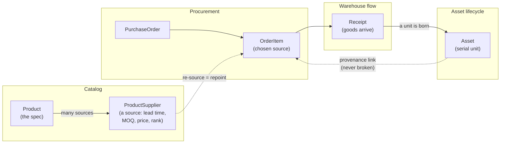
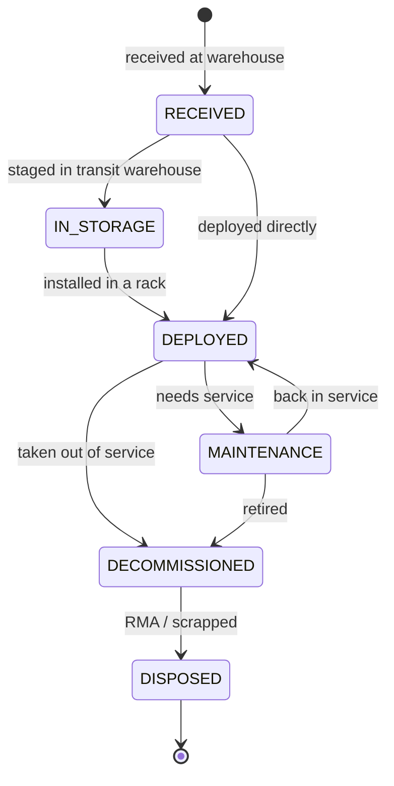

# SCM Master

[](https://scm-master-production.up.railway.app)
[](https://scm-power-bi-production.up.railway.app)
[](https://www.python.org/)
[](https://fastapi.tiangolo.com/)
[](https://www.sqlalchemy.org/)
[](https://www.postgresql.org/)
[](backend/tests/)
[](https://docs.astral.sh/ruff/)
[](https://www.anthropic.com/)

A supply-chain management system for **hardware procurement and asset lifecycle tracking** — built for the case where a small, fast-turning *transit warehouse* feeds equipment into datacenter racks.

It joins together three things that off-the-shelf tools usually keep apart:

1. **Procurement** — what you buy and from whom.
2. **Warehouse flow** — receiving goods into a transit warehouse.
3. **Asset lifecycle** — following each physical unit from arrival all the way to decommission.

## What makes it different

Most warehouse apps stop at "stock in, stock out." Most CMDBs (configuration-management databases) only start once a unit is already racked. Neither follows a single unit across that boundary.

This system models the **continuous identity of an asset** as its spine. When a serialised unit is received, an `Asset` is born. The *same* row then moves through the warehouse and into a rack — its location and status change, but its identity, and its link back to the purchase-order line it came from, never breaks. That unbroken thread is what makes end-to-end spend and provenance tracing possible.

The second deliberate design choice is **multi-sourcing**. A `Product` (the spec) is kept separate from a `ProductSupplier` (one row per source of that product). "Replacing a supplier" — critical under spiky demand and long chip lead times — is then just choosing a different source, without losing the product's identity or its purchase history.

## How it flows

The process the system models, end to end — from picking a source to a unit's final disposal:



### Asset lifecycle (the spine)

A single serial-tracked unit, followed for its whole life. Its location and status change, but its identity — and its link back to the order line it came from — never breaks:



## Domain model

The data model is organised into three modules under [`backend/app/models/`](backend/app/models/):

### Catalog — *the what and the who-we-buy-from* ([`catalog.py`](backend/app/models/catalog.py))

| Entity | Role |
| --- | --- |
| `Organization` | A company we deal with — supplier and/or manufacturer (flagged by role, so one org can be both). |
| `Product` | The supplier-independent spec (a server model, a CPU SKU, a DIMM). Hardware doesn't expire, so there's deliberately no expiry field. |
| `ProductSupplier` | One **source** for a product. Carries the levers that matter under demand spikes: lead time, minimum order quantity, contract price, and a `preference_rank` (lower = preferred). Multiple rows per product = multi-sourcing. |

### Procurement — *the buying* ([`procurement.py`](backend/app/models/procurement.py))

| Entity | Role |
| --- | --- |
| `PurchaseOrder` | A buy from a supplier, with a status lifecycle (`PENDING → APPROVED → PLACED → PARTIALLY_RECEIVED → RECEIVED`, or `CANCELLED`) and a destination location. |
| `OrderItem` | A line on an order. Points at the chosen `ProductSupplier` — so **re-sourcing a line is just repointing this link** to a different source of the same product. Carries the inbound-timing data a future capacity planner will use. |

### Flow & lifecycle — *receiving, then the life of a unit* ([`flow.py`](backend/app/models/flow.py))

| Entity | Role |
| --- | --- |
| `Location` | A place — self-referential, so a rack nests under a datacenter and the transit warehouse is just another location. Capacity is a tunable, initially-unknown knob. |
| `Receipt` / `ReceiptItem` | An inbound receiving event against a purchase order. |
| `Asset` | **The spine.** A single serial-tracked unit, followed for its whole life: `RECEIVED → IN_STORAGE → DEPLOYED → MAINTENANCE → DECOMMISSIONED → DISPOSED`. Keeps a current location and an unbroken link to the order line it originated from. |

All entities share a UUID primary key and `date_created` / `last_updated` audit columns (via mixins in [`db.py`](backend/app/core/db.py)).

## Tech stack

- **Python** with **FastAPI** for the API.
- **SQLAlchemy 2.0** (typed `Mapped[...]` models) for the ORM.
- **Pydantic 2** / **pydantic-settings** for config and (eventually) request/response schemas.
- **SQLite** by default for development; point `DATABASE_URL` at a `postgresql://` URL for production — the same code runs against both.

## Project layout

```
backend/
  alembic/          # versioned migrations (env.py wired to app settings + metadata)
  app/
    core/
      config.py     # settings (env / .env driven)
      db.py         # engine, session factory, Base + Id/Timestamp mixins
      security.py   # bcrypt hashing + JWT access tokens
      observability.py  # JSON logging + request-id middleware
    models/         # SQLAlchemy ORM models (catalog, procurement, flow, auth)
    integrations/   # ERP/P2P adapter layer: Coupa CSV adapter + idempotent sync
    schemas/        # Pydantic Create/Update/Read per domain
    services/       # business rules: CRUDService base + domain services
                    #   lifecycle (state machine), asset (receiving + events),
                    #   provenance, sourcing, analytics, planning, auth
    api/
      deps.py       # get_db (per-request transaction) + auth deps (require_role)
      errors.py     # ServiceError -> HTTP status mapping
      v1/           # one APIRouter per domain, mounted at /api/v1
    seed.py         # realistic hardware fixture data (+ bootstrap admin)
    main.py         # FastAPI app: /api/v1, /health, /readyz, serves the frontend
  tests/            # pytest suite (unit + API integration)
  Dockerfile
  alembic.ini · ruff.toml · pytest.ini · requirements.txt
frontend/           # dependency-free operations UI (served at /)
ci/                 # CI workflow (copy into .github/workflows/ to activate)
docker-compose.yml  # Postgres + api
```

## Getting started

From the `backend/` directory:

```powershell
python -m venv .venv
.venv\Scripts\pip install -r requirements.txt
.venv\Scripts\alembic upgrade head        # create/upgrade the schema
.venv\Scripts\python -m app.seed_demo      # demo-ready dataset (every screen populated)
.venv\Scripts\uvicorn app.main:app --reload
```

> **Demo dataset.** `app.seed_demo` builds a lived-in Frankfurt-DC operation through
> the real services: 6 suppliers, 6 products, 9 sourcing contracts across every
> lifecycle state, 8 purchase orders spanning every status (incl. an overdue and a
> cancelled one), ~126 serial-tracked assets driven through the full lifecycle
> (deployed / in storage / maintenance / decommissioned / disposed), an over-capacity
> staging cage, and the logistics control-tower shipments — so Overview, Assets,
> Inbound, Capacity, Spend, Contracts, Inventory, Tracking and the Agent all show
> real data. Log in with **`admin@example.com` / `admin`** (also `buyer`/`warehouse`/`dc`,
> password = role, to demo role-gating). For a minimal dataset instead, use `app.seed`.

The schema is owned by Alembic migrations — run `alembic upgrade head` to create or update it. Then open:

- **`/`** — the operations UI. Log in with the seeded admin (`admin@example.com` / `admin`).
- **`/docs`** — interactive OpenAPI/Swagger UI for the full `/api/v1` surface.
- `GET /health` — liveness; `GET /readyz` — readiness (checks the DB).

The API lives under `/api/v1`:

- **Auth** — `POST /auth/login` (returns a JWT), `/auth/register` (admin-only), `/auth/me`.
- **Catalog** — `/organizations`, `/products`, `/product-suppliers`.
- **Procurement** — `/purchase-orders` (nested lines), `/{id}/status` (approval), `/{id}/items/{lineId}/resource` (supplier-swap).
- **Flow** — `/locations`.
- **Receiving** — `POST /purchase-orders/{id}/receipts` turns ordered units into assets.
- **Assets** — `/assets` (filter by status/location), `/assets/{id}/transition`, `/move`, `/events`, `/provenance`.
- **Sourcing & analytics** — `/products/{id}/sources`, `/analytics/spend[...]`.
- **Planning** — `/planning/inbound`, `/planning/capacity`, `/planning/forecast`.
- **Integrations** — `POST /integrations/coupa/import` ingests a Coupa PO export (CSV); `dry_run=true` previews, idempotent on `(source_system, external_ref)`. See [`docs/integration-architecture.md`](docs/integration-architecture.md).
- **Analytics exports (BI)** — `/analytics/exports/forecast-accuracy.csv`, `/demand-history.csv`, `/spend.csv`: flat CSV facts for Power BI/Tableau, including the demand forecast **backtested** against ~18 months of seeded history. See [`docs/powerbi-analytics.md`](docs/powerbi-analytics.md).
- **Requisitions (auto-buy + approval)** — `POST /requisitions/run` stages Purchase Requests from live demand; ones clearing a **learned** confidence bar auto-convert to a PO, the rest wait as an editable cart (`/requisitions`, `PATCH …/lines/{id}`, `…/approve`, `…/reject`). Outcome-feedback calibration adjusts the bar per product/supplier (`/requisitions/calibration`).

Most write endpoints are role-gated (send the JWT as a `Bearer` token); reads need any authenticated user. Run with Docker via `docker compose up --build`. By default this uses a local `scm.db` SQLite file; point `DATABASE_URL` at a `postgresql://` URL for production.

## Status & roadmap

The **domain model is in place**. Below is the full intended scope, sequenced into phases — each phase is independently useful and builds on the one before it.

### Phase 0 — Foundation ✅ *(done)*

- [x] Core setup — config (env / `.env`), engine + session factory, `Base` with UUID + audit mixins.
- [x] Domain model — Catalog (`Organization`, `Product`, `ProductSupplier`), Procurement (`PurchaseOrder`, `OrderItem`), Flow & lifecycle (`Location`, `Receipt`, `ReceiptItem`, `Asset`).
- [x] FastAPI app skeleton with `/health` and `/schema` sanity checks.

### Phase 1 — Persistence & API surface ✅ *(done)*

- [x] **Alembic migrations** — schema is now versioned (`alembic upgrade head`); `env.py` reads the app's settings + metadata, so migrations never drift from the code.
- [x] **Pydantic schemas** — `Create` / `Update` / `Read` models per entity in [`app/schemas/`](backend/app/schemas/), decoupled from the ORM.
- [x] **CRUD routes** — catalog (organizations, products, sources), procurement (orders + nested lines), locations, under `/api/v1`.
- [x] **Repository / service layer** — a generic `CRUDService` plus thin domain services in [`app/services/`](backend/app/services/) holding the business rules; domain errors map centrally to HTTP codes (404/409/422).
- [x] **Seed data** — a realistic hardware scenario ([`app/seed.py`](backend/app/seed.py)): 5 orgs, 4 products multi-sourced across 7 sources, a warehouse + datacenter + 2 racks, and a pending purchase order.

### Phase 2 — Asset lifecycle service ✅ *(done)* — *the heart of the system*

- [x] **Receiving** — `POST /purchase-orders/{id}/receipts` (full or partial); each unit spawns an `Asset` in `RECEIVED` (auto-generated serial), linked back to its `OrderItem`. Order status advances `PARTIALLY_RECEIVED → RECEIVED` automatically from cumulative received-vs-ordered quantity; over-receipt is rejected.
- [x] **Guarded state machine** — a pure, testable transition table ([`services/lifecycle.py`](backend/app/services/lifecycle.py)) enforcing `RECEIVED → IN_STORAGE → DEPLOYED → MAINTENANCE → DECOMMISSIONED → DISPOSED` (plus the side-paths); illegal jumps are rejected with a 422 explaining what *is* allowed.
- [x] **Moves & deployment** — relocate an asset (`POST /assets/{id}/move`); deploying into a rack stamps `deployed_date` and current location.
- [x] **Lifecycle event log** — a new append-only `AssetEvent` table records every status/location change (type, from→to, actor, note, timestamp); `GET /assets/{id}/events` returns the full history.
- [x] **Provenance API** — `GET /assets/{id}/provenance` traces an asset back to order line → order → supplier → unit spend; `GET /order-items/{id}/assets` lists every asset a line produced.

### Phase 3 — Sourcing & procurement intelligence ✅ *(done)*

- [x] **Supplier-swap workflow** — `POST /purchase-orders/{id}/items/{lineId}/resource` repoints a line to a different `ProductSupplier` of the same product (and re-prices from the new source); blocked once the order is placed.
- [x] **Sourcing suggestions** — `GET /products/{id}/sources` ranks candidate sources by `preference_rank` → lead time → price ([`services/sourcing.py`](backend/app/services/sourcing.py)).
- [x] **Order approval flow** — `POST /purchase-orders/{id}/status` drives `PENDING → APPROVED → PLACED` (or `CANCELLED`) through a guarded transition table; receipt-driven statuses can't be set by hand. *(Role gating lands with auth in Phase 5.)*
- [x] **Spend analytics** — `GET /analytics/spend[/by-supplier|/by-product|/by-category]`, computed from *received* assets via the never-broken asset→order provenance link ([`services/analytics.py`](backend/app/services/analytics.py)).

### Phase 4 — Capacity & flow planning ✅ *(done)*

- [x] **Inbound pipeline view** — `GET /planning/inbound`: open order lines with quantity still outstanding, ETA, and an overdue flag.
- [x] **Warehouse capacity model** — `GET /planning/capacity`: per-location used/free/utilisation against `Location.capacity`, with an `over_capacity` flag.
- [x] **Deployment forecasting** — `GET /planning/forecast`: deployable units = on-hand (RECEIVED/IN_STORAGE) + still-inbound ([`services/planning.py`](backend/app/services/planning.py)).

### Phase 5 — Operations & hardening ✅ *(done)*

- [x] **Test suite** — pytest: pure unit tests for the lifecycle state machine + API integration tests over an isolated in-memory DB ([`backend/tests/`](backend/tests/)); 55 tests across every phase.
- [x] **AuthN / AuthZ** — JWT login (bcrypt + PyJWT), a `User`/`Role` model, and role-gated writes: PROCUREMENT (orders/approvals/re-sourcing), WAREHOUSE (receiving), WAREHOUSE+DATACENTER (asset transitions); ADMIN passes all. ([`core/security.py`](backend/app/core/security.py), [`api/v1/auth.py`](backend/app/api/v1/auth.py)).
- [x] **Observability** — JSON structured logging, a per-request correlation id (`X-Request-ID`), an access log line, and `/readyz` (DB check) alongside `/health` ([`core/observability.py`](backend/app/core/observability.py)).
- [x] **Containerisation & CI** — [`Dockerfile`](backend/Dockerfile) (non-root) + [`docker-compose.yml`](docker-compose.yml) (Postgres), and a GitHub Actions pipeline in [`.github/workflows/ci.yml`](.github/workflows/ci.yml): a **SQLite** job (ruff lint → migrate-check for no schema drift → pytest) and a **Postgres** job that runs migrations + the full suite against a real Postgres service to catch dialect drift.
- [x] **Frontend** — a dependency-free operations UI ([`frontend/`](frontend/)) served by FastAPI at `/`: login, the asset board with one-click lifecycle transitions and provenance trace, inbound pipeline, capacity, and spend.

### Phase 6 — Enterprise integration (SAP + Coupa) 🟡 *(in progress)*

Built so SCM-Master can run *alongside* an existing ERP/P2P landscape as the
intelligence layer rather than replace it — reading their master/transactional
data and (next) proposing actions back as requisitions. Full design:
[`docs/integration-architecture.md`](docs/integration-architecture.md).

- [x] **External-identity model** — a `(source_system, external_ref)` key on `Organization`, `Product`, and `PurchaseOrder` so synced records map back to their source-of-truth and round-trip without duplicating.
- [x] **Adapter layer** — a hexagonal port/adapter boundary ([`app/integrations/`](backend/app/integrations/)): adapters map an upstream wire format onto canonical records; one source-agnostic **sync engine** upserts them through the *existing* domain services (no rules duplicated).
- [x] **Coupa inbound (CSV)** — `POST /integrations/coupa/import` ingests a Coupa PO export, deduping suppliers/materials and grouping lines into POs; **idempotent** (re-import updates, never duplicates), with a true `dry_run` preview (runs in a rolled-back SAVEPOINT).
- [ ] **SAP inbound** — `sap.py` adapter mapping IDoc / OData (material + vendor master, PO/GR) onto the same canonical records.
- [ ] **Write-back** — emit **requisitions** to Coupa (not POs), so Coupa keeps approval + invoice matching; backed by an outbox + idempotency keys.
- [ ] **Scheduled / event-driven sync** and **SSO (OIDC/SAML against Azure AD)**.

### Phase 7 — Autonomous agent + analytics + production hardening ✅ *(done)*

- [x] **Procurement agent** — an LLM-backed copilot ([`app/agent/`](backend/app/agent/)) that detects demand, nets it against on-hand + inbound, sources to a preferred supplier, applies MOQ, and judges each bundle. High-confidence bundles auto-place; the rest wait for a human.
- [x] **Requisitions (PR → PO) with self-calibration** — `POST /requisitions/run` stages **Purchase Requests** (editable) from live demand; ones clearing a *learned* confidence bar auto-convert to a fixed **Purchase Order**, the rest land as an editable cart (`/requisitions`, `PATCH …/lines/{id}`, `…/approve`, `…/reject`). Outcome-feedback calibration moves the bar per product/supplier (`/requisitions/calibration`). An order is never larger than the warehouse can store.
- [x] **Capacity diagnosis** — `GET /planning/capacity/diagnosis` traces an over-capacity location to its cause (by product / source PO / status) and recommends a *placement* action (rebalance / hold inbound / add capacity), never a buy; `GET /planning/storage-headroom` caps how much can be ordered and still stored.
- [x] **Logistics tracking** — control-tower shipments with a milestone trail, derived from the real POs so Tracking reconciles with Procurement/Inbound.
- [x] **Demand history + forecast backtest** — ~18 months of dated usage ([`app/seed_history.py`](backend/app/seed_history.py)) so the forecast can be scored (MAPE / bias) against actuals, with flat CSV exports for Power BI.
- [x] **Production hardening** — fail-closed config guard (refuses to boot in prod with an insecure/short `SECRET_KEY`), an in-process per-IP rate limit on `/auth/login` (HTTP 429 + `Retry-After`), and `/schema` locked to ADMIN.
- [x] **Forge-locked production + self-wiring demo** — `SCM_ENV=prod` makes the app refuse to seed, refuse demo accounts, and refuse non-persistent (SQLite) storage; the demo auto-seeds on every boot. Ships the Postgres driver and auto-pins it on `DATABASE_URL`.
- [x] **Two-stack live deployment** — isolated demo and production stacks on separate Railway projects + databases (each with its own [analytics cockpit](https://github.com/eugnmueller-87/SCM-POWER-BI)); production deploys from a dedicated `production` branch. Runbook in [docs/DEPLOY.md](docs/DEPLOY.md).

### Phase 8 — Cost intelligence: should-cost + TCO ✅ *(done)*

The procurement IP layer — turn a vendor quote into a defensible number, then
follow the asset's whole-life cost. Both are **deterministic engines** (the
LLM, where used, only proposes; tested code decides), specced before code in
[docs/should_cost_model.md](docs/should_cost_model.md).

- [x] **Should-cost engine** — a 5-element clean-sheet teardown ([`app/services/costing.py`](backend/app/services/costing.py)) that rebuilds a server config from components: memory/flash/metal/PCB indexed to **commodity markets**, CPU/GPU as a list-price benchmark band. Produces a **cost floor** and a fair **target price**; the gap to a vendor quote is the addressable negotiation saving. `POST /products/{id}/should-cost`, `GET …/cost-gap`, `GET …/sensitivity` (floor vs DRAM/NAND ±X%), plus `analytics/should-cost/{by-supplier,savings}`. Self-calibrating commodity series with a deliberate memory spike.
- [x] **Total Cost of Ownership (TCO)** — per-asset waterfall ([`app/services/tco.py`](backend/app/services/tco.py)): `acquisition + landed + deployment + lifetime OpEx + end-of-life − recovery`, anchored on **actual-paid** acquisition (via the provenance chain) with the should-cost target surfaced as a derived variance. Five layer tables, multi-row landed/deployment, 60-month OpEx ledgers. `GET /assets/{id}/tco`, `GET /tco/portfolio`, `GET /tco/by-class` — with an optional landed-type exclusion filter for **tariff scenarios** and a fail-loud non-EUR guard.
- [x] **TSCMC, correctly defined** — the portfolio rollup exposes per-layer subtotals and **two** labelled ratios: `total_cost_pct` (ΣTCO ÷ baseline) and `tscmc_pct` (Σ(TCO − acquisition) ÷ baseline) — the SCOR/APQC Total Supply-Chain Management Cost deliberately **excludes** acquisition.
- [x] **Deterministic synthetic generator** ([`app/seed_tco.py`](backend/app/seed_tco.py)) — ~400 assets across storage/compute/GPU/switch, internally consistent across every cost layer, seedable + reproducible. Surfaces the headline insight: on GPU nodes, **lifetime OpEx can exceed the purchase price**.
- [x] **Cockpit pages** — "Should-Cost / Margin Lever" and "TCO" tabs in the [analytics cockpit](https://github.com/eugnmueller-87/SCM-POWER-BI), reading the live API.

## Live deployment — two isolated stacks

The system runs as **two completely separate stacks** that share no database and
cannot affect each other — a public demo and a forge-locked production:

| | **Demo** | **Production** |
| --- | --- | --- |
| App | [scm-master-production](https://scm-master-production.up.railway.app) | own Railway project + Postgres |
| Analytics cockpit | [scm-power-bi-production](https://scm-power-bi-production.up.railway.app) | own cockpit, wired to the prod API |
| Data | self-seeds on boot (always populated) | **empty** — real data only |
| Mode | `SCM_ENV` unset | `SCM_ENV=prod` (forge-locked) |

The **analytics cockpit** ([SCM-POWER-BI](https://github.com/eugnmueller-87/SCM-POWER-BI))
is a thin server-side proxy: it logs into one SCM Master instance, pulls the
analytics endpoints, and serves an executive dashboard — so each environment's
cockpit reflects only its own data.

### Production is forge-locked

When `SCM_ENV=prod`, the app refuses to do anything that could corrupt real data:

- **Never seeds** — the demo seeders refuse to run, even if `SEED_DEMO=1` is set by mistake.
- **No demo accounts** — no guest user, and it rejects the weak default admin password.
- **Persistent storage only** — refuses to boot on SQLite (must be Postgres).
- **Fails closed** — won't boot with an insecure or <32-char `SECRET_KEY`.

The demo, by contrast, **self-wires**: it auto-seeds a lived-in dataset on every
boot (no flag needed), so it is never empty.

### Environment variables

| Variable | Demo | Production |
| --- | --- | --- |
| `DATABASE_URL` | own Postgres (or SQLite) | own Postgres (`postgresql://…` — driver is auto-pinned) |
| `SCM_ENV` | unset | `prod` |
| `SECRET_KEY` | any | **strong, ≥32 chars** (enforced) |
| `ADMIN_PASSWORD` | — | a real password (no weak default in prod) |
| `SEED_DEMO` | `1` or unset (auto-seeds) | leave unset / `0` |
| `ANTHROPIC_API_KEY` | optional | optional (same key fine for both) |
| `SCM_ANALYTICS_URL` | demo cockpit URL | prod cockpit URL |

Boot order is always `alembic upgrade head` → ensure login users → self-wiring
demo seed (skipped in prod) → serve. See [docs/DEPLOY.md](docs/DEPLOY.md) for the
full runbook (provisioning each stack, wiring the cockpit, branch strategy).
